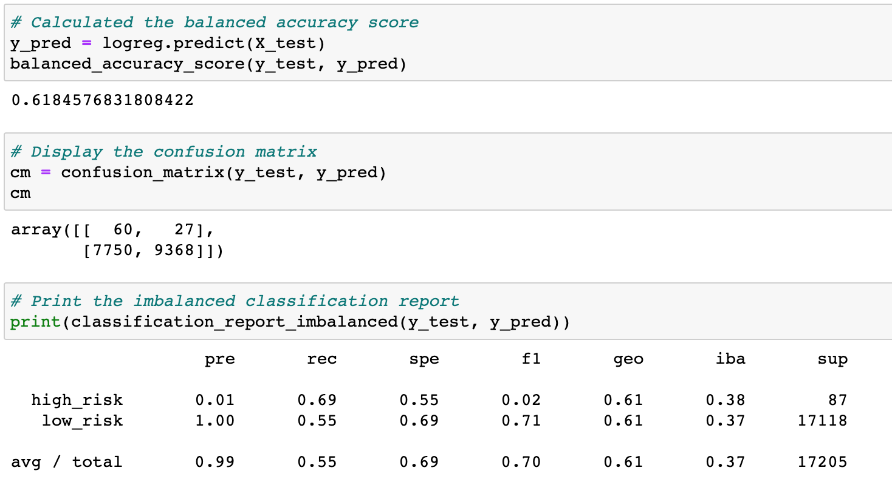
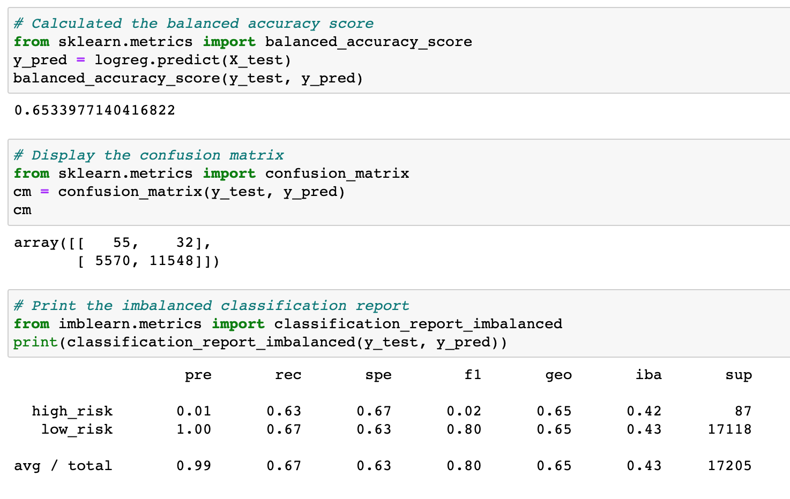
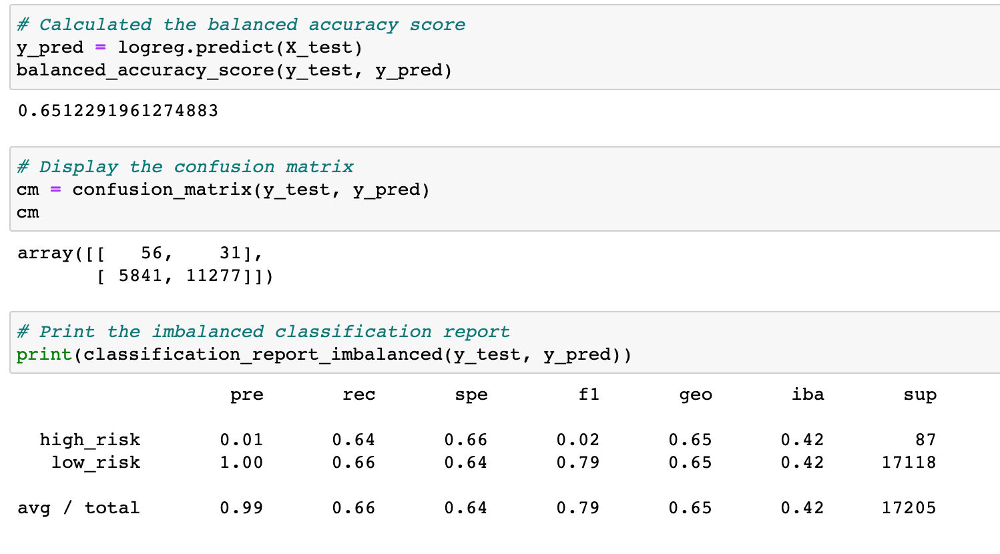
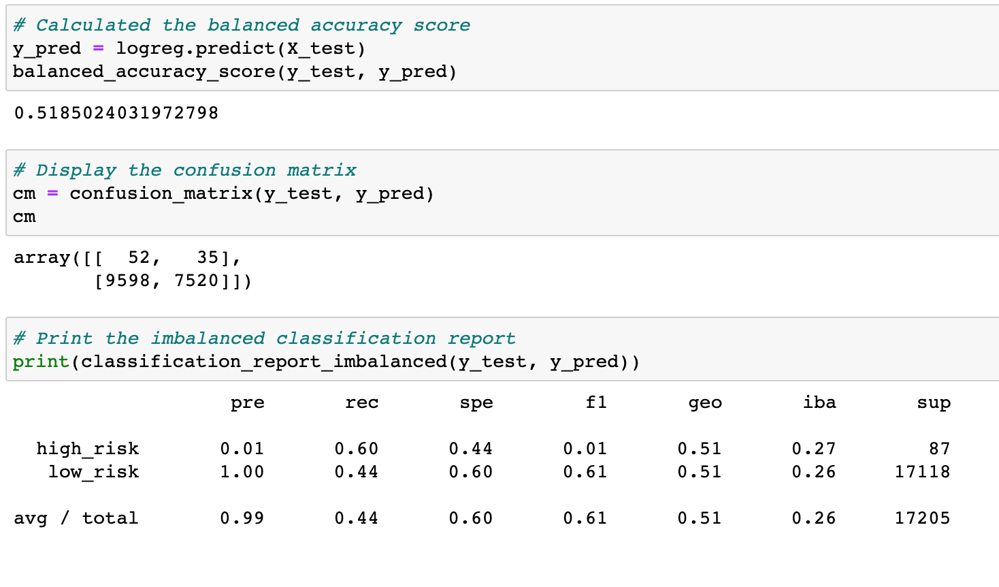
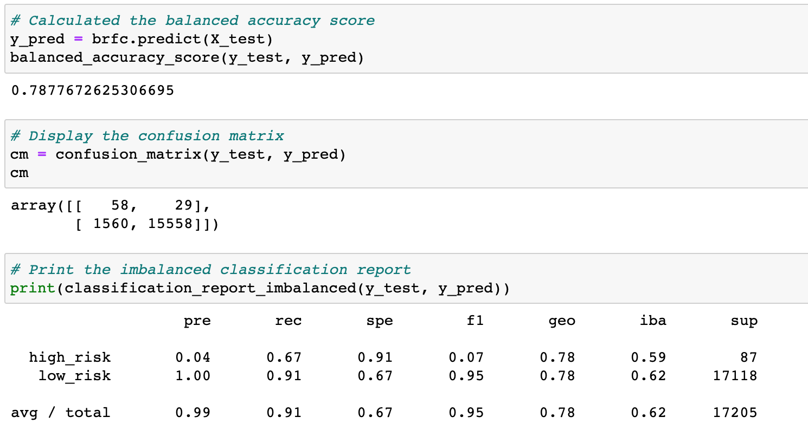
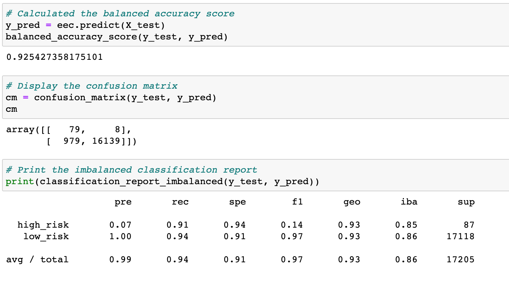

# Credit_Risk_Analysis

## Project Overview
In this project, we leveraged multiple machine learning methods to evaluate and predict credit risk. The classifiers used to predict such risk were as follows:
- Random OverSampler
- SMOTE
- Cluster Centroids
- SMOTEEN
- Balanced Random Forest Classifier
- Easy Ensemble Classifier

The performances of these models will tell us which are impactful enough to recommend for use in credit risk analyses.

## Results

### Random Over Sampler

- Balanced Accuracy Score is 62%.
- High-risk precision is 1% with with 69% sensitivity.
- Low-risk precision is nearly 100% with with 55% sensitivity.

### SMOTE

- Balanced Accuracy Score is 65%.
- High-risk precision is 1% with with 63% sensitivity.
- Low-risk precision is nearly 100% with with 67% sensitivity.

### Cluster Centroids

- Balanced Accuracy Score is 65%.
- High-risk precision is 1% with with 64% sensitivity.
- Low-risk precision is nearly 100% with with 66% sensitivity.

### SMOTEEN

- Balanced Accuracy Score is 52%.
- High-risk precision is 1% with with 60% sensitivity.
- Low-risk precision is nearly 100% with with 44% sensitivity.

### Balanced Random Forest Classifier

- Balanced Accuracy Score is 79%.
- High-risk precision is 4% with with 67% sensitivity.
- Low-risk precision is nearly 100% with with 91% sensitivity.

### Easy Ensemble Classifier

- Balanced Accuracy Score is 93%.
- High-risk precision is 7% with with 91% sensitivity.
- Low-risk precision is nearly 100% with with 94% sensitivity.

## Summary

All of the models used to perform the credit risk analysis show lower-than-desired precision in predicting high credit risk. The ensemble models showed increased balanced accuracy scores, thus indicating they are better predictors of credit risk than the others. The Easy Ensemble Classifier model returns a recall of 91% so it detects the vast majority of high-risk credit. However, the model does present a low precision, which present many false-positives, thus resulting in many missed opportunities for the bank's potential business. So despite the Easy Ensemble Classifier's high balanced accuracy score, I would still not advise using any of these models to predict credit risk.
